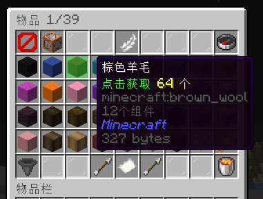
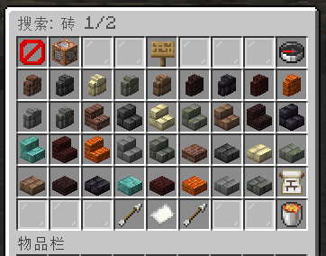
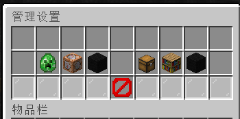
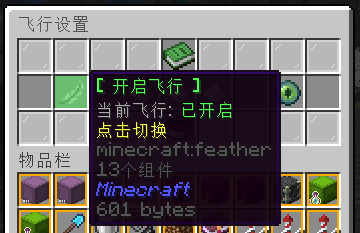
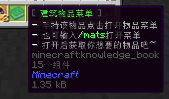
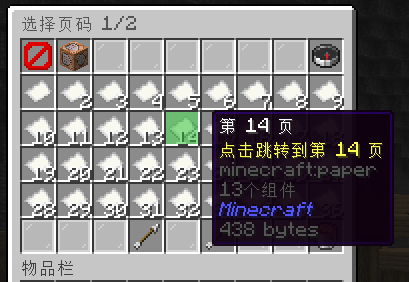
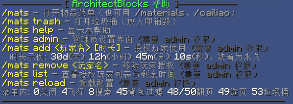

<p align="center">

</p>

<h1 align="center">ArchitectBlocks</h1>

<p align="center">Minecraft 物品总库插件：全物品检索 · 自定义物品上传 · 黑白名单 · 多语言搜索 · 限时授权</p>

<div align="center">
    
    
    
    
    <br>
    
    
    
    <br>
    
    
    
    
</div>

## 插件定位

服务器里常有这样的需求：有玩家（或建筑队）申请做大型建筑，靠生存肝材料不现实，但你又不放心直接给创造——创造权限一旦下放，误伤地形、顺手拿走不该拿的东西、权限失控，都是隐患。

ArchitectBlocks 就是为这个场景设计的：**让信任的建筑师在不开创造的前提下，安全、隐蔽、可控地随意获取物品**。

- **对建筑师**：一个命令 / 一个快捷物品，任意原版物品成组获取；聊天栏多语言搜索；页码跳转与记忆；管理员还能上传带 NBT 的特殊物品供他们取用；内置飞行开关/三档速度/永久夜视
- **对生存玩家**：零影响——他们看不到这个菜单，世界里的经济与生存节奏不受干扰
- **对服主**：多层控制权始终在手里——谁能用（权限/限时授权/全局开关）、能拿什么（黑白名单模式、管理员物品开关、刷怪蛋开关、物品来源）、拿多快（冷却、数量）；授权可限时（如 30 天后自动失效）；所有配置游戏内实时生效，动过的每一笔都进数据库

一句话：**在不给创造的前提下，为你熟悉的建筑师们开一条不影响任何人的建筑高速路。**

---


## 插件截图
<<<<<<< HEAD
=======

让你们看看写这个的笨蛋xwx，ouo

>>>>>>> 9f73003 (docs: README tweak + new screenshot (stupid-author Minecraft character))

**主菜单**（全物品列表，点击获取）：



**聊天栏搜索**（输入关键词即搜，支持中英多语言）：



**管理员设置**（开关、名单、上传、授权一站式管理）：



**飞行设置**（开关、三档速度、永久夜视、发放快捷物品）：



**快捷物品**（知识之书，点击打开菜单，附魔光效）：



**页码跳转**（纸张堆叠数 = 页码，点击直达）：



**帮助命令**：



---

## 特性

### 物品总库
- **零维护物品列表**：启动时遍历 `Material.values()`，随服务器版本自动更新
- **全物品主菜单**：36 个/页，循环翻页，纸张页码跳转（堆叠数=页码，支持超过 64）
- **聊天栏搜索**：消息截获不广播、超时可配；匹配英文 ID、英文名、配置的任意多种语言；语言文件从官方源自动下载（BMCLAPI 优先回退 Mojang，SHA1 校验，随版本更新），翻译表缓存进数据库
- **背包已有物品视图**：把想要的物品放进背包点漏斗即可筛出
- **每视图独立记忆页码**：主页/背包视图/搜索结果各记各的页

### 物品总库的边界（重要）
主菜单检索的是**服务器注册的全部物品类型**——它是"物品 ID 级"的检索逻辑，获取的都是**不带 NBT 的纯净物品**（等同于原版 `/give` 无附加参数的效果）。这意味着：

- ✅ 建筑方块（石头、木板、混凝土……）、工具、材料——直接搜索获取，这就是绝大多数建筑场景
- ❌ **带 NBT 的物品拿不到纯净版**：药水（效果/时长）、附魔书（具体附魔）、烟花（配方）、旗帜图案、刷怪蛋（指定生物）、地图、带自定义名称/附魔的装备……

后者需要用下面的**上传功能**解决。

### 自定义物品（上传）
- **管理员上传**：上传页保持打开，点击背包物品即以 Base64 完整序列化存储——**NBT 原汁原味**（药水效果、附魔书内容、材质包物品、其他插件生成的物品都完整保留），玩家获取的是一模一样的副本
- **典型用法**：给建筑队准备"附魔精准采集镐""夜视药水""特效烟花"——先在创造/生存里做出成品，打开上传页点一下，之后所有人随时可取
- **物品来源切换**：仅原版 / 仅上传 / 原版+上传（默认）
- 搜索按自定义名称匹配，未命名的回退基础物品语言文字
- 相同 NBT 自动去重，不会重复占用列表

### 名单体系
- **黑名单模式**（默认）：存入黑名单库 ID 的物品隐藏
- **白名单模式**：仅白名单库内存入 ID 的物品可获取
- **两套独立数据库表**，单一管理入口随模式变色
- 上传的自定义物品不受名单控制
- 管理员物品（21 种创造专属方块）与刷怪蛋独立开关

### 授权体系
- **数据库限时授权**：`/mats add <玩家> [时长]`，支持 `30d`/`12h`/`45m`/`10s`（可组合如 `1d12h`，纯数字=天，缺省永久）
- **授权管理 GUI** + `/mats list` 命令：显示每个玩家剩余时间（永久 / N 天），点击移除
- 到期自动失效并清理

### 内置快捷物品
- 独立 `quick-item` 配置段（材质/名称/描述/附魔光效）
- 授权玩家上线自动发放；名称描述支持 PlaceholderAPI 变量
- **严格资格**：仅 use 权限 / 全局允许 / 数据库授权可持有——admin 权限不隐式放行
- 无资格自动收回；配置变更（指纹）自动回收旧版并换发新版
- 禁止放置、禁止放入容器（点击/Shift/数字键/拖拽全拦截）

### 实用工具
- **飞行设置菜单**：开关飞行、三档速度、永久夜视（主页 4 号羽毛进入）
- **垃圾桶**：全部槽位可放，退出销毁
- **取物冷却**（默认 1 秒）、数量可配置、自动适配最大堆叠
- **PlaceholderAPI 变量**：`%architectblocks_authorized%` / `%architectblocks_expires%` / `%architectblocks_flying%`
- **配置自愈**：版本号 + 关键键检测双保险；reload 时自动重建误删文件

---

## 安装

1. 将 `ArchitectBlocks-x.x.x.jar` 放入服务器 `plugins/` 文件夹
2. 重启服务器（SQLite 自动建库，语言文件自动下载）
3. `/mats add 你的名字` 给自己授权，获得快捷物品

> 要求：Spigot / Paper 系 1.21+，Java 21+。PlaceholderAPI 可选（装了才有变量和物品文本占位符）。

---

## 命令与权限

| 命令 | 权限 | 说明 |
|------|------|------|
| `/mats` | `architectblocks.use` * | 打开物品菜单（别名 `/materials`、`/cailiao`） |
| `/mats trash` | 同上 | 垃圾桶 |
| `/mats help` | — | 帮助 |
| `/mats admin` | `architectblocks.admin`（默认 OP） | 管理员设置界面 |
| `/mats add <玩家名> [时长]` | `architectblocks.admin` | 授权（`30d`/`12h`/`45m`/`10s`/纯数字=天/缺省永久） |
| `/mats remove <玩家名>` | `architectblocks.admin` | 移除授权 |
| `/mats list` | `architectblocks.admin` | 授权列表与剩余时间 |
| `/mats reload` | `architectblocks.admin` | 重载配置 |

\* 菜单与所有功能：admin **或** use **或** 授权 **或** 全局允许。**快捷物品发放是严格通道**：仅 use / 授权 / 全局允许（admin 不隐式放行——管理员也要进名单或持有 use）。

## 界面速查

| 槽位 | 功能 |
|------|------|
| 0 | 关闭（屏障） |
| 1 | 管理员设置（命令方块，仅管理员） |
| 4 | 飞行设置（羽毛） |
| 7 | 发放快捷物品（知识之书，仅管理员） |
| 8 | 搜索（指南针）/ 搜索页返回 |
| 9–44 | 物品区（点击获取） |
| 45 | 只显示背包已有（漏斗） |
| 48 / 50 | 上一页 / 下一页（循环） |
| 49 | 选择页码（纸张） |
| 53 | 垃圾桶（岩浆桶） |

## 管理界面（`/mats admin`）

| 按钮 | 功能 |
|------|------|
| 允许刷怪蛋（苦力怕刷怪蛋） | 刷怪蛋显示开关 |
| 允许管理员物品（命令方块） | 21 种创造专属方块开关 |
| 名单管理（羊毛随模式变色） | 管当前模式名单库：点背包物品存入 ID、点列表移出 |
| 授权玩家管理（下界之星） | 玩家列表 + 剩余时间，点击移除 |
| 上传物品管理（箱子） | 上传/删除自定义物品 |
| 物品来源（书架） | 仅原版 / 仅上传 / 原版+上传 |
| 名单模式（羊毛变色） | 黑名单 ↔ 白名单 |

---

## 配置结构

| 位置 | 内容 |
|------|------|
| `config.yml` | 访问控制、快捷物品、数量/冷却/排序、搜索语言、数据库、GUI、消息 |
| `plugins/ArchitectBlocks/lang/` | 自动下载的官方语言文件 |
| `data.db`（SQLite）| 设置、黑白名单、授权、页码记忆、语言缓存、自定义物品 |

<details>
<summary>数据库表一览</summary>

| 表 | 内容 |
|----|------|
| `ab_settings` | 开关设置键值 |
| `ab_blacklist` / `ab_whitelist` | 名单物品 ID（独立两库） |
| `ab_access` | 授权玩家（名称 + 过期时间戳，0=永久） |
| `ab_player_pages` / `ab_view` | 各视图记忆页码与恢复目标 |
| `ab_lang` | 语言文件缓存（MySQL 多服共享） |
| `ab_custom_items` | 自定义物品（Base64 完整序列化） |
</details>

## 构建与图标

```bash
mvn package          # 产物 target/ArchitectBlocks-x.x.x.jar
python assets/make_icon.py   # 重新生成图标（需要 Pillow）
```

## 设计说明

- 语言文件不打包进插件：服务器 jar → 下载文件 → 数据库缓存三级来源；`en_us.json` 由客户端 jar 流式抽取（不在资源索引中）
- 快捷物品用 PersistentDataContainer 双键（标记+配置指纹）识别，改名无法伪造；无资格/配置变更由 30 秒周期任务自动回收
- "管理员物品"名单是唯一需要随版本维护的代码内列表，运营中用游戏内黑名单即时兜底

## 开源协议

MIT License，见 [LICENSE](LICENSE)。

## 贡献者

| 贡献者 | 角色 |
|--------|------|
| [Dalict](https://github.com/Dalict) | 作者 / 主要维护者 |
| ZTF3 | 贡献者 |

## 支持与反馈

- 问题反馈：[GitHub Issues](https://github.com/Dalict/ArchitectBlocks/issues)
- 源码仓库：[https://github.com/Dalict/ArchitectBlocks](https://github.com/Dalict/ArchitectBlocks)
